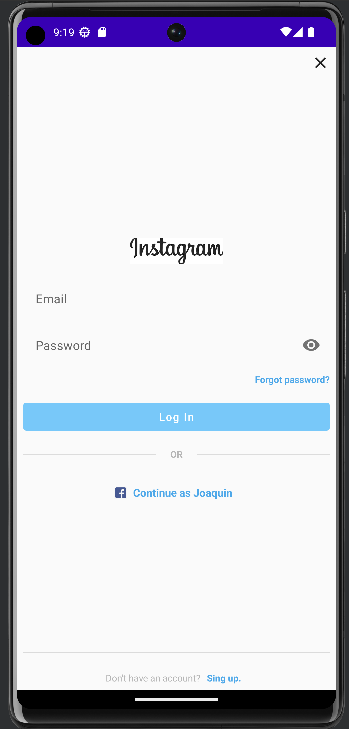
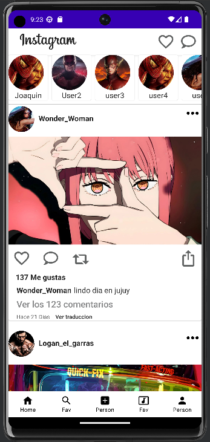
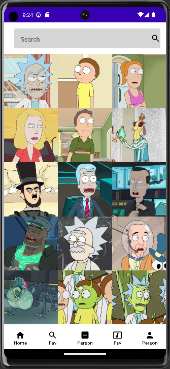
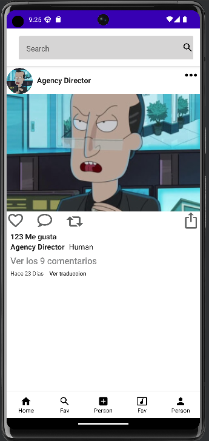

# InstagramAPP / Rick and Morty api 

## My Android project is an application with an interface similar to Instagram that consumes data from the Rick and Morty API. It allows users to explore and obtain information about the characters from the Rick and Morty series.


## characteristics

- Use of RecyclerView
- Layout with JetPack Compose
- coroutines
- Retrofit
- Navigation Compose
- Dependency injection with Dagger Hilt
- MVVM (Model-View-ViewModel) architecture
- Clean Architecture


## Installation:

```
Dependencies{
  implementation "io.coil-kt:coil-compose:2.0.0"


    //Coroutines
    implementation 'org.jetbrains.kotlinx:kotlinx-coroutines-core:1.6.1'
    implementation 'org.jetbrains.kotlinx:kotlinx-coroutines-android:1.6.1'


    //Retrofit
    implementation 'com.squareup.retrofit2:retrofit:2.9.0'
    implementation 'com.squareup.retrofit2:converter-gson:2.9.0'

    //Navigation
    implementation "androidx.navigation:navigation-compose:2.5.1"

    //DaggerHilt
    implementation"com.google.dagger:hilt-android:2.41"
    kapt "com.google.dagger:hilt-android-compiler:2.41"
    implementation "androidx.hilt:hilt-navigation-compose:1.0.0-alpha03"
}
```


# Layout

## Login



## Home

## Search

## Detail Search


# Project under development currently 🛠⚙

